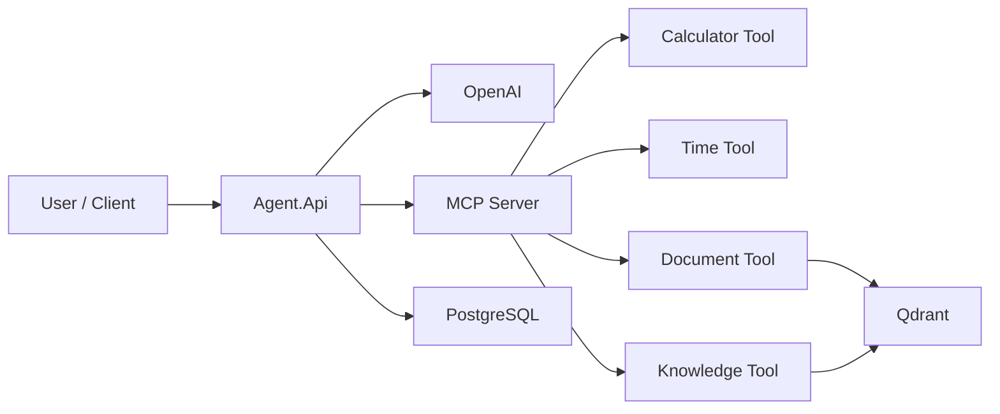

# AI Agent with MCP + RAG

A production-ready AI Agent built with **ASP.NET Core**, **OpenAI**, **Model Context Protocol (MCP)**, **PostgreSQL**, and **Qdrant**.

The project demonstrates how to build a modern AI application that supports tool calling, retrieval augmented generation (RAG), persistent conversations, and production-ready infrastructure.

---

## Features

- 🤖 OpenAI Chat Completion
- 🔧 Model Context Protocol (MCP)
- 🛠 Dynamic Tool Discovery & Execution
- 💬 Conversation Persistence
- 🧠 Retrieval Augmented Generation (RAG)
- 🗄 PostgreSQL Conversation Storage
- 📚 Qdrant Vector Database
- ❤️ Health Checks
- ⚙️ Configuration Validation
- 🐳 Docker & Docker Compose
- 🧪 Unit Tests
- 🚀 GitHub Actions CI

---

## Technology Stack

| Technology | Purpose |
|------------|---------|
| .NET 8 | Backend |
| ASP.NET Core | Web API |
| OpenAI SDK | LLM |
| MCP | Tool Calling |
| Entity Framework Core | ORM |
| PostgreSQL | Conversation Storage |
| Qdrant | Vector Database |
| Docker | Containers |
| xUnit | Testing |
| Moq | Mocking |
| FluentAssertions | Assertions |

---

## Project Structure

```text
src
│
├── Agent.Api
│   ├── Chat
│   ├── Configuration
│   ├── Conversations
│   ├── HealthChecks
│   ├── Mcp
│   ├── OpenAI
│   └── Tools
│
├── Mcp.Tools.Server
│
tests
│
└── Agent.Api.Tests
```

---

## Running locally

```bash
dotnet restore

dotnet build

dotnet test

dotnet run --project src/Agent.Api
```

---

## Running with Docker

```bash
docker compose up -d --build
```

---

## Health Checks

| Endpoint | Purpose |
|----------|---------|
| `/health` | Complete system health |
| `/health/live` | Liveness |
| `/health/ready` | Readiness |

---

## CI

GitHub Actions automatically performs:

- Restore
- Build
- Unit Tests
- Code Coverage

---

## Future Improvements

- Angular Client
- Authentication
- Authorization
- Streaming Responses
- Kubernetes
- Azure OpenAI
- Semantic Kernel

---

## License

MIT

               +------------------+
               |    Angular UI    |
               +--------+---------+
                        |
                        v
               +------------------+
               |    Agent.Api     |
               +--------+---------+
                        |
        +---------------+----------------+
        |               |                |
        v               v                v
+---------------+ +-------------+ +---------------+
|    OpenAI     | | PostgreSQL  | |  MCP Server   |
+---------------+ +-------------+ +-------+-------+
                                          |
                         +----------------+----------------+
                         |                |                |
                         v                v                v
                  Calculator         Documents       Knowledge
                                          |
                                          v
                                     Qdrant Vector DB

## Architecture


## Chat Flow

See:

- docs/diagrams/chat-sequence.md

## RAG Flow

See:

- docs/diagrams/rag-flow.md