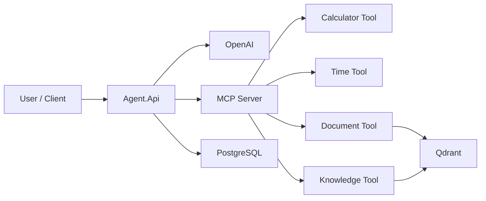

```mermaid
flowchart LR

    User["User / Client"]

    API["Agent.Api"]

    OpenAI["OpenAI"]

    MCP["MCP Server"]

    PG["PostgreSQL"]

    Q["Qdrant"]

    Calc["Calculator Tool"]

    Time["Time Tool"]

    Docs["Document Tool"]

    Know["Knowledge Tool"]

    User --> API

    API --> OpenAI

    API --> PG

    API --> MCP

    MCP --> Calc
    MCP --> Time
    MCP --> Docs
    MCP --> Know

    Docs --> Q
    Know --> Q
```