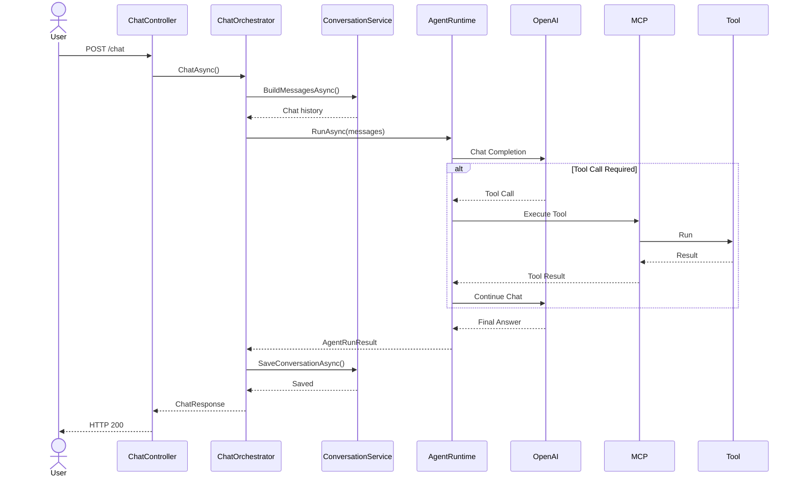

# Chat Request Flow

```mermaid
sequenceDiagram

actor User

participant Controller as ChatController
participant Orchestrator as ChatOrchestrator
participant Conversation as ConversationService
participant Runtime as AgentRuntime
participant OpenAI
participant MCP
participant Tool

User->>Controller: POST /chat

Controller->>Orchestrator: ChatAsync()

Orchestrator->>Conversation: BuildMessagesAsync()

Conversation-->>Orchestrator: Chat history

Orchestrator->>Runtime: RunAsync(messages)

Runtime->>OpenAI: Chat Completion

alt Tool Call Required

    OpenAI-->>Runtime: Tool Call

    Runtime->>MCP: Execute Tool

    MCP->>Tool: Run

    Tool-->>MCP: Result

    MCP-->>Runtime: Tool Result

    Runtime->>OpenAI: Continue Chat

end

OpenAI-->>Runtime: Final Answer

Runtime-->>Orchestrator: AgentRunResult

Orchestrator->>Conversation: SaveConversationAsync()

Conversation-->>Orchestrator: Saved

Orchestrator-->>Controller: ChatResponse

Controller-->>User: HTTP 200
```