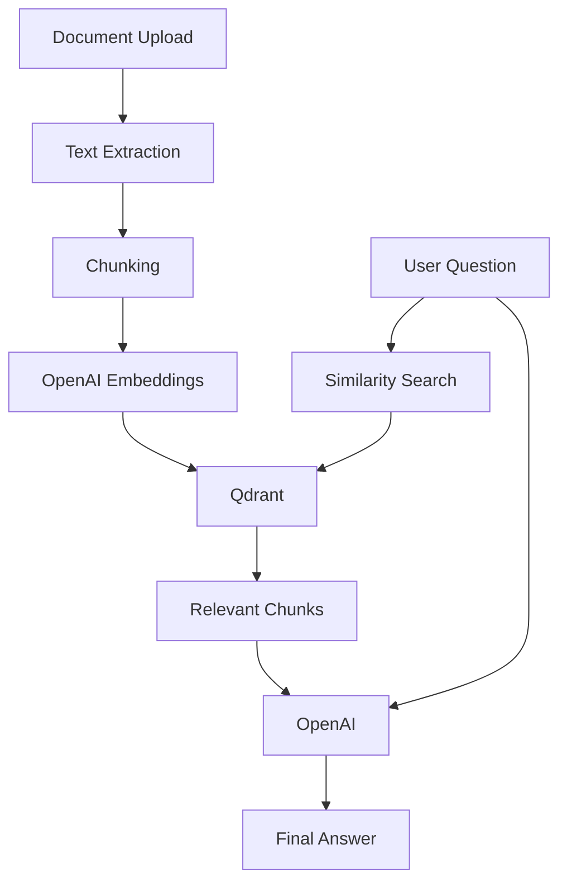

# RAG Flow

```mermaid
flowchart TD

Document["Document Upload"]

Extract["Text Extraction"]

Chunk["Chunking"]

Embedding["OpenAI Embeddings"]

Qdrant["Qdrant"]

Question["User Question"]

Search["Similarity Search"]

Context["Relevant Chunks"]

OpenAI["OpenAI"]

Answer["Final Answer"]

Document --> Extract

Extract --> Chunk

Chunk --> Embedding

Embedding --> Qdrant

Question --> Search

Search --> Qdrant

Qdrant --> Context

Context --> OpenAI

Question --> OpenAI

OpenAI --> Answer
```